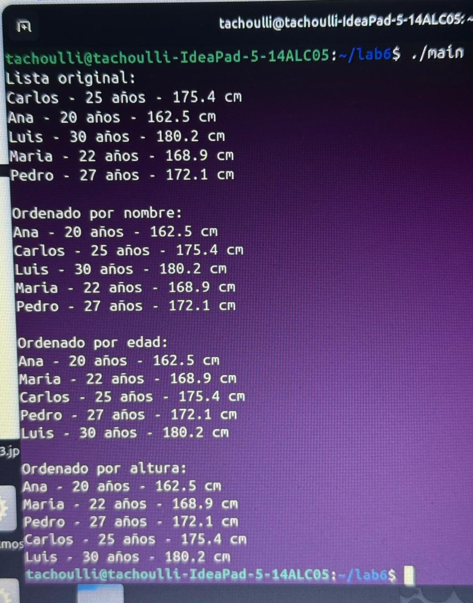
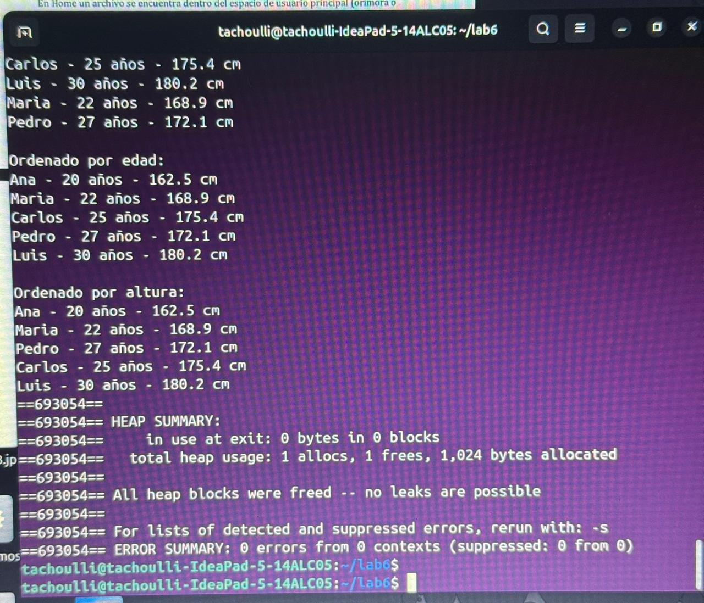

# Laboratorio 6
## Uso de estructuras y ordenamiento con qsort()

**Curso:** Programación Bajo Plataformas Abiertas

**Estudiante:** Harim Méndez Gómez

---

# Objetivo

Implementar un programa en lenguaje C que utilice estructuras (`struct`) y la función `qsort()` para ordenar un arreglo de registros utilizando distintos criterios de comparación.

---

# Desarrollo

Se creó una estructura denominada `Person`, la cual almacena la información de una persona mediante tres atributos:

- Nombre
- Edad
- Altura

Posteriormente se definió un arreglo de cinco personas y se implementaron tres funciones de comparación:

- `compare_by_name()`
- `compare_by_age()`
- `compare_by_height()`

Cada una de estas funciones es utilizada por `qsort()` para ordenar el arreglo según el criterio correspondiente.

El programa imprime inicialmente la lista original y posteriormente muestra los resultados ordenados por nombre, edad y altura.

---

# Compilación

El programa fue compilado utilizando el compilador GCC mediante el siguiente comando:

```bash
gcc -Wall -Wextra -std=c11 main.c -o main
```

También se automatizó el proceso mediante un **Makefile**, permitiendo compilar, ejecutar, verificar con Valgrind y limpiar archivos temporales.

---

# Resultados

## Ejecución del programa

La siguiente imagen muestra la correcta ejecución del programa y el ordenamiento de los registros utilizando los tres criterios solicitados.



---

## Verificación con Valgrind

Para verificar el correcto manejo de memoria se ejecutó el programa utilizando **Valgrind**.

Los resultados muestran que no existen fugas de memoria ni errores de acceso.



---

# Conclusiones

- Se implementó correctamente una estructura para almacenar información de personas.
- Se utilizó la función `qsort()` para ordenar el arreglo mediante diferentes funciones de comparación.
- Se automatizó la compilación mediante un Makefile.
- La ejecución con Valgrind confirmó que el programa no presenta fugas de memoria ni errores, garantizando un manejo adecuado de los recursos.
